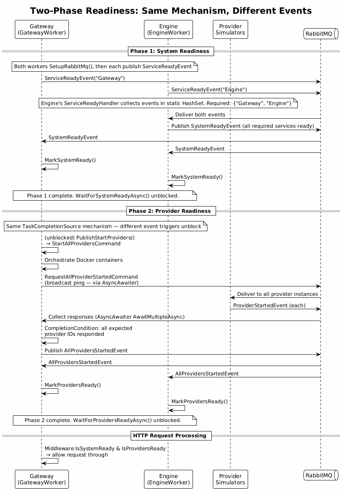
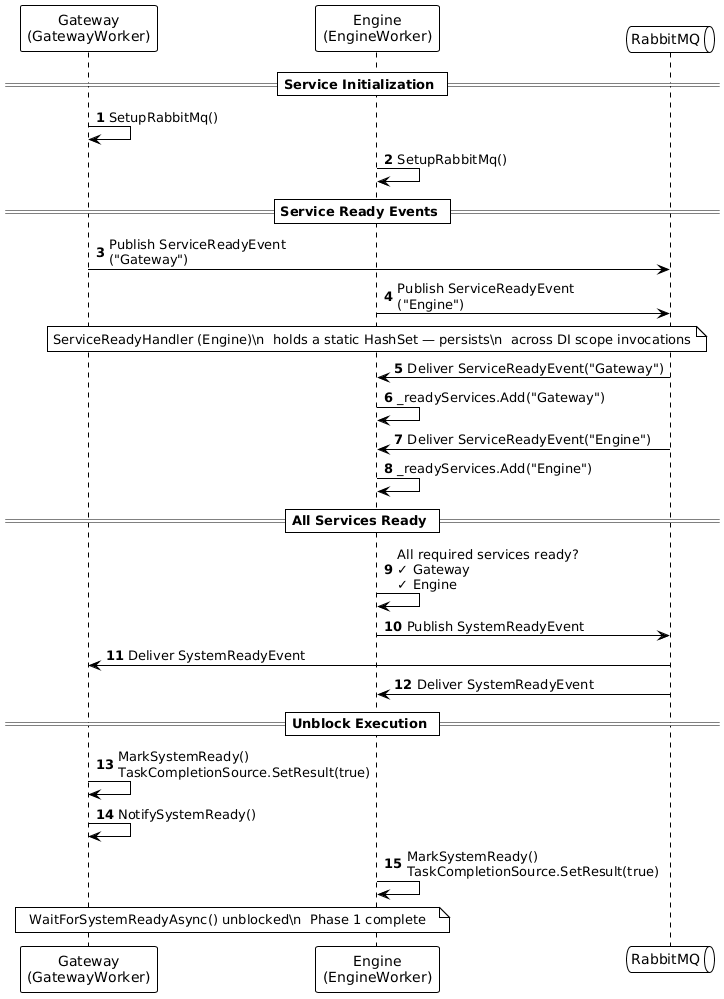
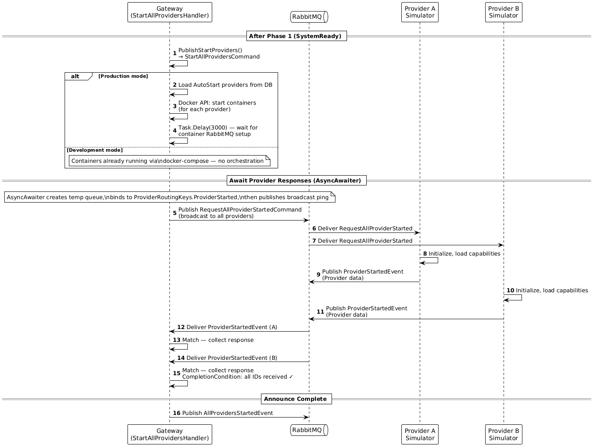

# System Readiness

When the system starts, services need to coordinate their initialization before accepting real work. The system uses a **two-phase readiness model** to ensure that no optimization requests are processed until both the core services and all provider containers are confirmed ready.

---

## Core Mechanism

[`SystemReadinessService`](../ManufacturingOptimization.Common.Messaging/SystemReadinessService.cs) is a `BackgroundService` that holds two `TaskCompletionSource<bool>` instances — one per phase:

```csharp
private readonly TaskCompletionSource<bool> _systemReadyTcs = new();
private readonly TaskCompletionSource<bool> _providersReadyTcs = new();
```

Any code in the system that needs to wait for readiness calls one of the blocking methods:

```csharp
await _readinessService.WaitForSystemReadyAsync(cancellationToken);
await _readinessService.WaitForProvidersReadyAsync(cancellationToken);
```

These methods simply await the corresponding TCS task. The calling thread is suspended without spinning and without polling — it resumes only when another part of the system calls `MarkSystemReady()` or `MarkProvidersReady()`, which resolves the TCS:

```csharp
public void MarkSystemReady()
{
    _systemReadyTcs.TrySetResult(true);
}
```

Both Gateway and Engine each have their own instance of `SystemReadinessService` registered as a hosted singleton. The service itself just runs `Task.Delay(Infinite)` in its execute loop — its only job is to hold state and expose the wait/mark methods.

---

## Phase 1: System Readiness

**Goal:** Confirm that both Gateway and Engine have fully started and subscribed to RabbitMQ.

### Sequence

**1. Setup and announce**

Both [`GatewayWorker`](../ManufacturingOptimization.Gateway/GatewayWorker.cs) and [`EngineWorker`](../ManufacturingOptimization.Engine/EngineWorker.cs) declare their queues and subscriptions at startup, then each immediately publishes `ServiceReadyEvent` with their name:

```csharp
// GatewayWorker.ExecuteAsync
await SetupRabbitMq(cancellationToken);
PublishStartupEvent();                              // → ServiceReadyEvent { ServiceName = "Gateway" }
await _readinessService.WaitForSystemReadyAsync();  // << suspended here
PublishStartProviders();                            // << resumes when Phase 1 completes
```

```csharp
// EngineWorker.ExecuteAsync
await SetupRabbitMq(cancellationToken);
PublishStartupEvent();                              // → ServiceReadyEvent { ServiceName = "Engine" }
await Task.Delay(Infinite, cancellationToken);      // Engine does not orchestrate providers
```

**2. Collect and coordinate — Engine's `ServiceReadyHandler`**

Engine's `ServiceReadyHandler` maintains a static `HashSet<string>` that persists across DI scopes. Each time it receives a `ServiceReadyEvent`, it adds the service name and checks whether all required services have reported:

```csharp
private readonly List<string> REQUIRED_SERVICES = new() { "Gateway", "Engine" };
private readonly static HashSet<string> _readyServices = new();

public Task HandleAsync(ServiceReadyEvent evt)
{
    lock (_readyServices)
    {
        _readyServices.Add(evt.ServiceName);
        if (REQUIRED_SERVICES.All(s => _readyServices.Contains(s)))
            _messagePublisher.Publish(Exchanges.System, SystemRoutingKeys.SystemReady, new SystemReadyEvent(...));
    }
    return Task.CompletedTask;
}
```

The set is static so that events arriving in separate DI scopes (each handler invocation creates a new scope) still contribute to the same accumulated state.

**3. Unblock**

Both Gateway and Engine are subscribed to `SystemReadyEvent`. When it arrives, each calls `MarkSystemReady()` on its own `SystemReadinessService` instance, resolving the local TCS and unblocking any waiting code.

---

## Phase 2: Provider Readiness

**Goal:** Confirm that all provider containers are running and have responded to a startup ping.

Phase 2 begins immediately after Phase 1 unblocks `GatewayWorker`. The Gateway publishes `StartAllProvidersCommand`, which is handled by `StartAllProvidersHandler`.

### Sequence

**1. Orchestrate containers**

In production mode, `StartAllProvidersHandler` reads all providers with `AutoStart = true` from the database, starts their Docker containers via `IProviderOrchestrator`

In development mode, the containers are already running via docker-compose — no orchestration step is needed.

**2. Request startup confirmation — `AwaitMultipleAsync`**

After containers are running (or assumed running in dev mode), the handler uses `AsyncAwaiter.AwaitMultipleAsync` to broadcast a startup ping and collect responses from all expected providers:

```csharp
var response = await _asyncAwaiter.AwaitMultipleAsync(new AwaitMultipleScenario<ProviderStartedEvent>
{
    Exchange = Exchanges.Provider,
    RoutingKey = ProviderRoutingKeys.ProviderStarted,
    Timeout = TimeSpan.FromSeconds(20),
    CompletionCondition = responses =>
        responses.Select(r => r.Provider.Id).ToHashSet().SetEquals(expectedProviderIds),
    BeforeAwait = () => _messagePublisher.Publish(
        Exchanges.Provider,
        ProviderRoutingKeys.RequestAllProviderStarted,
        new RequestAllProviderStartedCommand())
});
```

Each provider responds with `ProviderStartedEvent` carrying its own data. Completion fires when the set of responding IDs equals the expected set. See [02-messaging.md](02-messaging.md#asyncawaiter) for the internal `TaskCompletionSource` mechanics.

**3. Announce and unblock**

Once all providers have responded, `StartAllProvidersHandler` publishes `AllProvidersStartedEvent`. Both Gateway and Engine are subscribed:

- **Gateway's `AllProvidersStartedHandler`** calls `MarkProvidersReady()`
- **Engine's `AllProvidersStartedHandler`** calls `MarkProvidersReady()` on its own instance

Any code awaiting `WaitForProvidersReadyAsync()` is now unblocked.

---

## HTTP Protection — `SystemReadinessMiddleware`

Gateway protects all HTTP endpoints with [`SystemReadinessMiddleware`](../ManufacturingOptimization.Gateway/Middleware/SystemReadinessMiddleware.cs). Every incoming request is checked synchronously:

```csharp
if (!readinessService.IsSystemReady || !readinessService.IsProvidersReady)
    throw new ServiceNotReadyException();  // → 503
```

Exempted paths that bypass the check:
- `/api/notifications`
- `/api/system`
- `/api/dashboard`

These routes are allowed through during startup so the UI can show real-time readiness progress even before the system is fully initialized.

---

## Summary

| Phase | Trigger | Who coordinates | Who unblocks |
|---|---|---|---|
| **Phase 1** | `ServiceReadyEvent` from each service | Engine's `ServiceReadyHandler` accumulates; publishes `SystemReadyEvent` | All services call `MarkSystemReady()` |
| **Phase 2** | `StartAllProvidersCommand` (published by Gateway after Phase 1) | Gateway's `StartAllProvidersHandler` orchestrates containers and awaits all `ProviderStartedEvent`; publishes `AllProvidersStartedEvent` | All services call `MarkProvidersReady()` |

---

## Diagrams






