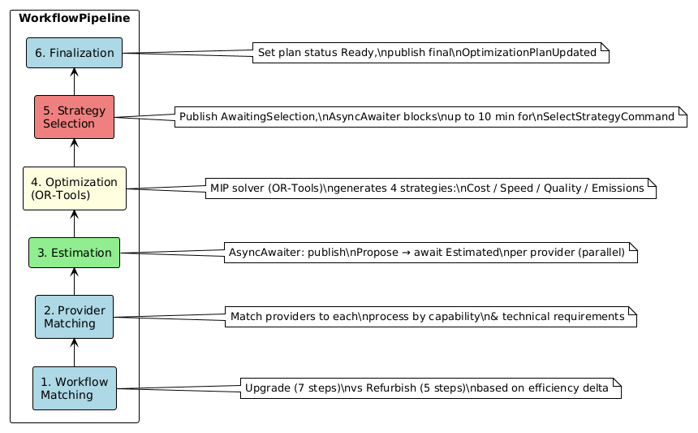
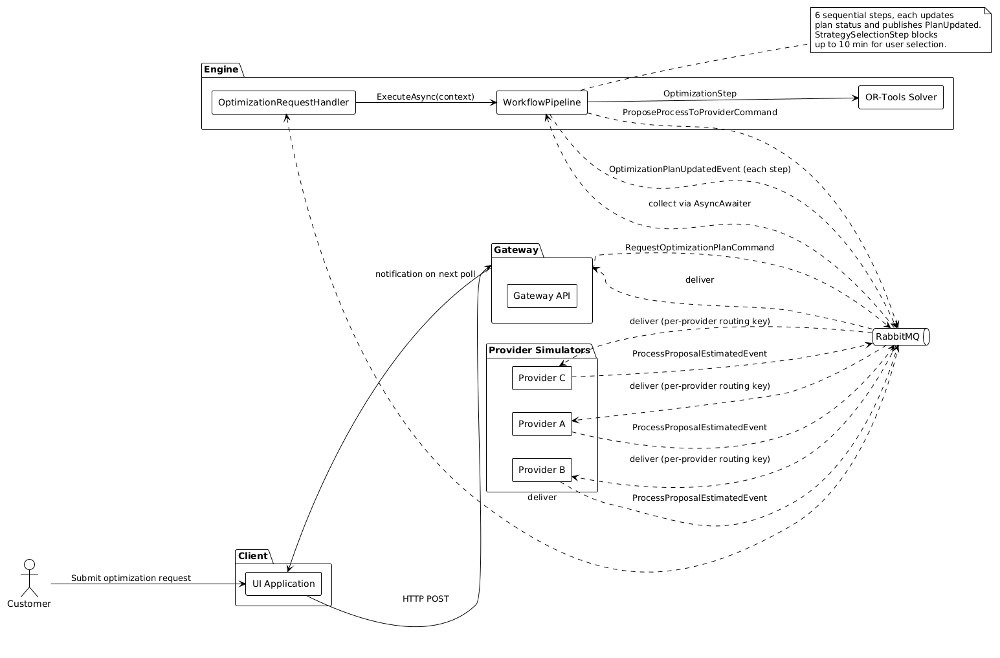

# Optimization Engine

## Role

Engine is the core optimization service. Its sole job is to receive optimization requests and execute the full workflow pipeline that produces an optimization plan.

When an optimization request arrives (via `RequestOptimizationPlanCommand` on the `optimization` exchange), Engine's [`OptimizationRequestHandler`](../ManufacturingOptimization.Engine/Handlers/OptimizationRequestHandler.cs) wakes up, waits until both readiness phases are complete, then builds and runs the pipeline:

```csharp
public async Task HandleAsync(RequestOptimizationPlanCommand command)
{
    await _readinessService.WaitForSystemReadyAsync();
    await _readinessService.WaitForProvidersReadyAsync();

    var context = new WorkflowContext { Request = command.Request, Plan = command.Plan };
    var pipeline = _pipelineFactory.CreateOptimizationPipeline();
    await pipeline.ExecuteAsync(context);
}
```

If any step throws, the plan is immediately transitioned to `Failed` status and `OptimizationPlanUpdatedEvent` is published so Gateway can persist the failure.

---

## Provider Awareness

Engine does not query providers from the database at request time. Instead it starts with an in-memory provider pool built from events: `EngineWorker` subscribes to `ProviderStartedEvent`, `ProviderStoppedEvent`, and `ProviderUpdatedEvent` at startup. By the time a request arrives, Provider repository already reflects the active provider set populated during Phase 2 of system startup.

---

## WorkflowContext

Every pipeline execution creates one `WorkflowContext` that flows through all steps:

```csharp
public class WorkflowContext
{
    public required OptimizationRequestModel Request { get; init; }
    public required OptimizationPlanModel Plan { get; init; }
    public string? WorkflowType { get; set; }           // "Upgrade" or "Refurbish"
    public List<WorkflowProcessStep> ProcessSteps { get; set; } = [];
}
```

Each step reads from and writes to this context. Intermediate results — matched providers, proposal IDs, estimates, provider schedules, computed time slots, generated strategies — all accumulate here as the pipeline progresses.

---

## Pipeline Steps

The pipeline is assembled by [`PipelineFactory`](../ManufacturingOptimization.Engine/OptimizationPipeline/PipelineFactory.cs)`.CreateOptimizationPipeline()` and always runs the same six steps in order:

```csharp
WorkflowMatchingStep → ProviderMatchingStep → EstimationStep →
OptimizationStep → StrategySelectionStep → FinalizationStep
```

Each step calls `NotifyOptimizationStepStarted(stepName, planId)` at its entry point and publishes `OptimizationPlanUpdatedEvent` with the updated plan status so Gateway persists progress in real time.

---

### Step 1 — WorkflowMatchingStep

Determines the workflow type by comparing `CurrentEfficiency` vs `TargetEfficiency` from the motor specs:

- **Upgrade** (`targetEfficiency > currentEfficiency`) — 7 process steps: Cleaning → Disassembly → Redesign → Turning → PartSubstitution → Reassembly → Certification
- **Refurbish** — 5 process steps: Cleaning → Disassembly → PartSubstitution → Reassembly → Certification

The list of `WorkflowProcessStep` objects is stored in `context.ProcessSteps`. Each one holds the process type and will accumulate matched providers in the next step.

Plan status transitions to `MatchingWorkflow`.

---

### Step 2 — ProviderMatchingStep

For each process step, queries the provider repository for all providers that have the required capability (`FindByProcess(processStep.Process)`), then filters them by technical requirements. Providers that don't meet the requirements are excluded.

The filtered list is stored as `processStep.MatchedProviders`. If no provider can cover any single process step, the step throws `OptimizationException` and the entire pipeline fails immediately.

Plan status transitions to `MatchingProviders`.

---

### Step 3 — EstimationStep

Sends process proposals to all matched providers and collects their estimates in parallel. For each `(processStep, provider)` pair, the step uses `AsyncAwaiter.AwaitAsync` to publish `ProposeProcessToProviderCommand` and wait for `ProcessProposalEstimatedEvent`:

```csharp
var response = await _asyncAwaiter.AwaitAsync(new AwaitScenario<ProcessProposalEstimatedEvent>
{
    Exchange = Exchanges.Process,
    RoutingKey = $"{ProcessRoutingKeys.Estimated}.{provider.ProviderId}",  // provider-specific
    Timeout = TimeSpan.FromSeconds(10),
    BeforeAwait = () => _messagePublisher.Publish(
        Exchanges.Process,
        $"{ProcessRoutingKeys.Propose}.{provider.ProviderId}",
        new ProposeProcessToProviderCommand { ... })
});
```

All proposals for a single process step are sent concurrently via `Task.WhenAll`. Providers that decline or time out are removed from that step's `MatchedProviders` list. If a provider accepts, its `ProposalId`, `Estimate` (cost, duration, quality score, emissions), and `Schedule` are stored in `MatchedProvider`.

If all providers for any step fail, the step throws and the plan fails.

Plan status transitions to `EstimatingCosts`.

---

### Step 4 — OptimizationStep

Uses **Google OR-Tools** (Mixed Integer Programming) to generate optimization strategies. The step runs the solver four times — once for each `OptimizationPriority`:

| Priority | Objective |
|---|---|
| `LowestCost` | minimize total cost |
| `FastestDelivery` | minimize total duration |
| `HighestQuality` | maximize quality score |
| `LowestEmissions` | minimize total emissions |

Before solving, each provider's schedule is broken into fixed-granularity time slots, indexed relative to the request's time window start. The MIP problem assigns exactly one provider to each process step, respecting time-ordering constraints (step N can only start after step N-1 finishes).

Each successful solve produces a `StrategyModel` stored in `context.Plan.Strategies`. After generation, schedules are clamped to stay within working hours. If no feasible solution is found for any priority, the step throws.

Plan status transitions to `GeneratingStrategies`.

---

### Step 5 — StrategySelectionStep

Publishes the current plan (now containing all strategies) with status `AwaitingStrategySelection`, then uses `AsyncAwaiter.AwaitAsync` to block and wait for `SelectStrategyCommand` on the `optimization` exchange — with a **10-minute timeout**:

```csharp
selectionCommand = await _asyncAwaiter.AwaitAsync(new AwaitScenario<SelectStrategyCommand>
{
    Exchange = Exchanges.Optimization,
    RoutingKey = OptimizationRoutingKeys.StrategySelected,
    Timeout = TimeSpan.FromMinutes(10),
    Match = cmd => cmd.RequestId == requestId,
    BeforeAwait = () => { /* publish PlanUpdated with AwaitingStrategySelection */ }
});
```

The `Match` predicate selects only the command for this specific request. While the pipeline is blocked here, other optimization requests are processed normally on separate handler invocations (each runs in its own DI scope). 

When the user selects a strategy in the UI, Gateway publishes `SelectStrategyCommand`, and the pipeline resumes. The selected strategy is set on the plan along with `SelectedAt` timestamp.

Plan status transitions to `StrategySelected`.

---

### Step 6 — FinalizationStep

Validates that a strategy was selected, sets the plan status to `Ready`, and publishes the final `OptimizationPlanUpdatedEvent`. At this point the plan is fully complete and persisted by Gateway's handler.

---

## Diagrams




